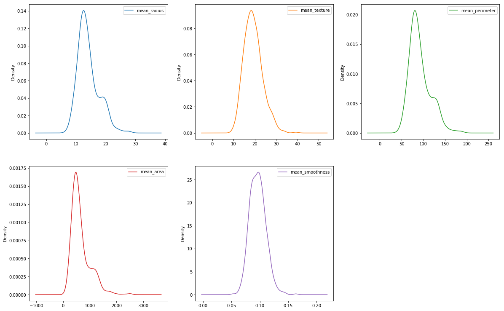
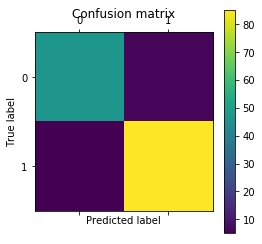
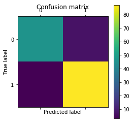

# Machine Learing Algorithms Analysis for Breast Cancer Classification

## Introduction
A performance anlyisis on three, common, supervised machine learning algorithms. All three algorithms were given the exact same data. The data can be found here: https://www.kaggle.com/merishnasuwal/breast-cancer-prediction-dataset

The data features are the dimentions of a found lump by patients, and a label whether it was cancerous or not. All programming is done with Python, scikit-learn, matplot, pandas, and numpy.


## Data Collection and Cleaning


```python
#imports
import pandas as pd
import matplotlib.pyplot as plt
import numpy as np

from sklearn.model_selection import train_test_split 
from sklearn.linear_model import LogisticRegression
from sklearn import svm
from sklearn.naive_bayes import GaussianNB

from sklearn.metrics import confusion_matrix


#import the data.
data = pd.read_csv('data.csv')

#Show first 5 entries.
data.head()
```


<div>
<style scoped>
    .dataframe tbody tr th:only-of-type {
        vertical-align: middle;
    }

    .dataframe tbody tr th {
        vertical-align: top;
    }

    .dataframe thead th {
        text-align: right;
    }
</style>
<table border="1" class="dataframe">
  <thead>
    <tr style="text-align: right;">
      <th></th>
      <th>mean_radius</th>
      <th>mean_texture</th>
      <th>mean_perimeter</th>
      <th>mean_area</th>
      <th>mean_smoothness</th>
      <th>diagnosis</th>
    </tr>
  </thead>
  <tbody>
    <tr>
      <th>0</th>
      <td>17.99</td>
      <td>10.38</td>
      <td>122.80</td>
      <td>1001.0</td>
      <td>0.11840</td>
      <td>0</td>
    </tr>
    <tr>
      <th>1</th>
      <td>20.57</td>
      <td>17.77</td>
      <td>132.90</td>
      <td>1326.0</td>
      <td>0.08474</td>
      <td>0</td>
    </tr>
    <tr>
      <th>2</th>
      <td>19.69</td>
      <td>21.25</td>
      <td>130.00</td>
      <td>1203.0</td>
      <td>0.10960</td>
      <td>0</td>
    </tr>
    <tr>
      <th>3</th>
      <td>11.42</td>
      <td>20.38</td>
      <td>77.58</td>
      <td>386.1</td>
      <td>0.14250</td>
      <td>0</td>
    </tr>
    <tr>
      <th>4</th>
      <td>20.29</td>
      <td>14.34</td>
      <td>135.10</td>
      <td>1297.0</td>
      <td>0.10030</td>
      <td>0</td>
    </tr>
  </tbody>
</table>
</div>


As stated above, the data consits of 5 features, and a binary choice of 0, or 1, for the label 'diagnosis'. In total we have 569 entries, each with 5 features and 1 label.

### Removing 'NaN' Entries

Some of the data could include entries with the data 'NaN' this is data that is missing, and needs to be removed.


```python
#Remove 'NaN'.
data.dropna(axis=0, inplace = True)
data.shape
```


    (569, 6)


After removing the entries with 'NaN' in the fields. The data is still left with 569 entires and of course still 5 features and 1 label. Therfore, no entries contaied 'NaN'.

### Sperating X and Y
In order to train our models, the data needs to be serperated into inputs 'x_values' and the coresponding outputs 'y_values'. To acheive this, the python library 'Panda' has supplied us with a function to extract all the features and labels, to create a NxM matrix of inputs and a Nx1 matrix of outputs. Where N is the number of training data, and M is the number of features. 


```python
#Seperating

#Get all, but the last columns, these are the input valuse.The last column, is the y_values.
x_values = data.iloc[:, :-1].values

#Only get the last column, these are the coresponding outputs.
y_values = data.iloc[:, -1].values

print 'x_values matrix dimensions (NxM): ', x_values.shape
print('')
print 'y_values matrix dimensions (Nx1): ', y_values.shape

data.iloc[:, :-1].plot(kind='density', subplots=True, layout=(3,3), figsize=(20,20), sharex=False)
plt.show()
```

    x_values matrix dimensions (NxM):  (569, 5)
    
    y_values matrix dimensions (Nx1):  (569,)





### Seperate into training and testing fields


```python
# Test size will be a quater. Also, this means the traing size will be three quaters.

x_train, x_test, y_train, y_test = train_test_split(x_values, y_values, test_size = 0.25, random_state = 0)

```

## Aanalysis

### Logistic Regression


```python
logReg = LogisticRegression(solver='liblinear')

pred = logReg.fit(x_train, y_train).predict(x_test)

cm = confusion_matrix(y_test, pred)

#print(tn, fp, fn, tp) 

# Show confusion matrix in a separate window
plt.matshow(cm)
plt.title('Confusion matrix')
plt.colorbar()
plt.ylabel('True label')
plt.xlabel('Predicted label')
plt.show()

tn, fp, fn, tp = cm.ravel()


# (TP+TN)/(TP+FP+TN+FN)
print('Accuracy: ' + str(round((float)(tp+tn)/(tp+fp+tn+fn), 4)*100) + '%')
# TP/(TP+FP)
print('Sensitivity: ' + str(round((float)(tp)/(tp+fp), 4)*100) + '%')
# TN/(TN+FN)
print('Specificity: ' + str(round((float)(tn)/(tn+fn), 4)*100) + '%')

```





    Accuracy: 92.31%
    Sensitivity: 93.41%
    Specificity: 90.38%


### SVM


```python
svc = svm.SVC(gamma='scale')
pred = svc.fit(x_train, y_train).predict(x_test)

cm = confusion_matrix(y_test, pred)

#print(tn, fp, fn, tp) 

# Show confusion matrix in a separate window
plt.matshow(cm)
plt.title('Confusion matrix')
plt.colorbar()
plt.ylabel('True label')
plt.xlabel('Predicted label')
plt.show()

tn, fp, fn, tp = cm.ravel()


# (TP+TN)/(TP+FP+TN+FN)
print('Accuracy: ' + str(round((float)(tp+tn)/(tp+fp+tn+fn), 4)*100) + '%')
# TP/(TP+FP)
print('Sensitivity: ' + str(round((float)(tp)/(tp+fp), 4)*100) + '%')
# TN/(TN+FN)
print('Specificity: ' + str(round((float)(tn)/(tn+fn), 4)*100) + '%')


```


    Accuracy: 88.11%
    Sensitivity: 85.44%
    Specificity: 95.0%


### Naive Bayesian


```python
nb = GaussianNB()
pred = nb.fit(x_train, y_train).predict(x_test)

cm = confusion_matrix(y_test, pred)

#print(tn, fp, fn, tp) 

# Show confusion matrix in a separate window
plt.matshow(cm)
plt.title('Confusion matrix')
plt.colorbar()
plt.ylabel('True label')
plt.xlabel('Predicted label')
plt.show()

tn, fp, fn, tp = cm.ravel()


# (TP+TN)/(TP+FP+TN+FN)
print('Accuracy: ' + str(round((float)(tp+tn)/(tp+fp+tn+fn), 4)*100) + '%')
# TP/(TP+FP)
print('Sensitivity: ' + str(round((float)(tp)/(tp+fp), 4)*100) + '%')
# TN/(TN+FN)
print('Specificity: ' + str(round((float)(tn)/(tn+fn), 4)*100) + '%')

```





    Accuracy: 93.01%
    Sensitivity: 92.55%
    Specificity: 93.88%

